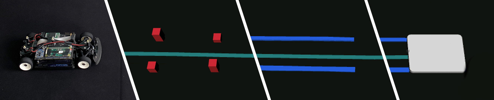
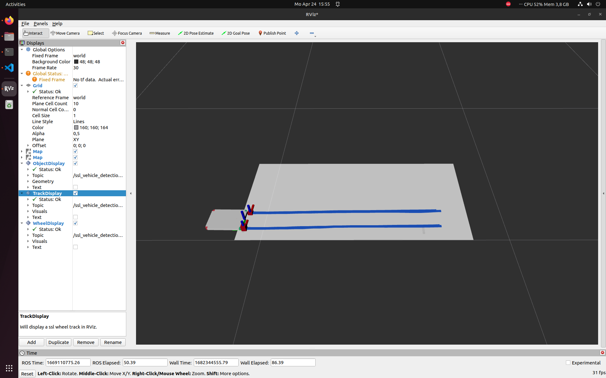

 

  

  <h3 align="center">SSL Vehicle Tracking</h3>

  

    Towards a comprehensive package for roadside vehicle tracking.
     
    <a href="https://github.com/embedded-software-laboratory/ssl-vehicle-tracking"><strong>Explore the project »</strong></a>
     
     
    <a href="https://www.youtube.com/watch?v=8wBv1dOc0Ag">View Demo</a>
    ·
    <a href="https://cpm.embedded.rwth-aachen.de/">Department</a>
    ·
    <a href="https://embedded.rwth-aachen.de/">Institution</a>
  

<!-- ABOUT THE PROJECT -->
## About The Project

This project is a ROS2 implementation of a tracking algorithm that can detect and track vehicles on a pressure-sensitive road surface. We developed this approach as a proof of concept in our paper <a href="#references">[1]</a>, demonstrating that the road surface itself can be used as a data source for vehicle localization. In addition to the algorithm, the package also provides a visualization tool.

(<a href="#readme-top">back to top</a>)

<!-- GETTING STARTED -->
## Getting Started

This tool is built with the colcon command line interface like any other ROS2 package. Instructions are found [here](https://docs.ros.org/en/humble/Tutorials/Beginner-Client-Libraries/Colcon-Tutorial.html).

(<a href="#readme-top">back to top</a>)

<!-- USAGE EXAMPLES -->
## Usage

The tracking pipeline needs a topic of type [OccupancyGridMap](http://docs.ros.org/en/api/nav_msgs/html/msg/OccupancyGrid.html). An example of a launch file can be found in the package ssl_vehicle_tracking. The provided RVIZ packages are automatically detected.

(<a href="#readme-top">back to top</a>)

<!-- LICENSE -->
## License

Distributed under the MIT License. See `LICENSE.txt` for more information.

(<a href="#readme-top">back to top</a>)

<!-- ACKNOWLEDGMENTS -->
## Acknowledgments

We acknowledge the financial support for this project by the Collaborative Research Center / Transregio 339 of the German Research Foundation (DFG).

* [ROS2](https://docs.ros.org/en/humble/index.html)
* [Stone Soup](https://stonesoup.readthedocs.io/)
* [Open CV](https://opencv.org/)
* [scikit-image](https://scikit-image.org/)
* [Readme Template](https://github.com/othneildrew/Best-README-Template)

(<a href="#readme-top">back to top</a>)

## References

* [1] S. Schäfer, H. Steidl, S. Kowalewski and B. Alrifaee, "Investigating a Pressure Sensitive Surface Layer for Vehicle Localization," 2023 IEEE Intelligent Vehicles Symposium (IV), Anchorage, AK, USA, 2023, pp. 1-6, doi: 10.1109/IV55152.2023.10186582.
